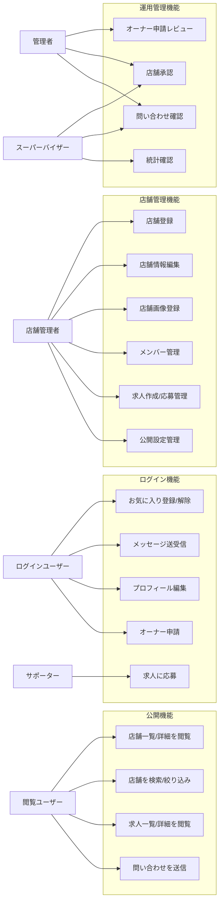

# portal-job 要件定義・サービス分析

## 1. プロジェクトの目的と背景

portal-job は、飲食・接客系店舗を中心に、店舗情報、求人、スタッフ公開設定、メッセージ、オーナー申請を一体で扱う多言語対応の店舗プラットフォームである。

初期リリースでは、店舗ページの公開、店舗オーナー/管理者による情報更新、ユーザーのお気に入り登録、求人閲覧/応募、店舗またはユーザー間のメッセージ送信、問い合わせ受付を主要価値とする。認証は Supabase Auth、アプリケーション API は Go API、フロントエンドは Next.js、画像配信は Cloudinary を利用する。FastAPI 実装は移行前の退避用コードとして残すが、リリース前の主検証対象は Go API とする。

本ドキュメントは、実装の根拠となる要件を固定し、リリース前の品質確認、テスト設計、将来の Cloudflare/GCP 移行判断に利用する。

## 2. スコープ

### 2.1 初期リリース対象

- 公開店舗一覧/店舗詳細の閲覧
- 店舗検索、カテゴリ、タグ絞り込み
- Supabase Auth によるサインイン/セッション管理
- プロフィール編集、プロフィール画像登録
- 店舗登録/編集、店舗画像登録
- 店舗メンバー管理、店舗別公開設定
- オーナー申請と管理者レビュー
- 求人一覧/詳細、求人作成、求人応募、応募ステータス管理
- お気に入り登録/解除
- メッセージ送受信、会話一覧
- 問い合わせ送信、管理者/スーパーバイザー確認
- 多言語表示と SEO の基本対応

### 2.2 初期リリース対象外

- 決済
- 高度なレコメンド
- OpenAI/Gemini 等の本格 AI 連携
- 複数画像ギャラリー、本文中画像差し込み
- シフト機能の本格公開
- Web Push 通知の本番運用
- Cloudinary から GCP Cloud Storage への完全移行

## 3. アクター

| アクター | 説明 |
| --- | --- |
| 閲覧ユーザー | 店舗、求人、公開プロフィールを閲覧する未ログイン/ログインユーザー |
| ログインユーザー | お気に入り、メッセージ、求人応募、プロフィール編集を行うユーザー |
| サポーター | 募集にエントリーし、サポータープロフィールを管理するユーザー |
| 店舗メンバー | 店舗に所属するスタッフ、キャスト、マネージャー、オーナー |
| 店舗管理者 | 店舗情報、求人、メンバー、公開設定を管理できるユーザー |
| 管理者 | オーナー申請、店舗承認、問い合わせ確認を行う運用者 |
| スーパーバイザー | 管理者より広い監督権限で店舗/問い合わせ/統計を確認する運用者 |

## 4. ユースケース図

## 5. 機能要件一覧

優先度は P0 がリリース必須、P1 が初期リリースで高優先、P2 がリリース後改善である。

| ID | 優先度 | 機能 | 要件 |
| --- | --- | --- | --- |
| FR-001 | P0 | 店舗一覧表示 | 承認済み店舗のみを一覧表示できること |
| FR-002 | P0 | 店舗詳細表示 | slug で店舗詳細を取得し、店舗画像、説明、タグ、SNSリンクを表示できること |
| FR-003 | P0 | 多言語ルーティング | `/ja`, `/en` など locale を含む URL で画面表示できること |
| FR-004 | P0 | 認証 | Supabase Auth のセッションを利用し、Go API へ Bearer token を送信できること |
| FR-005 | P0 | プロフィール同期 | サインイン時に Supabase ユーザーと `profiles` を同期できること |
| FR-006 | P0 | 店舗登録/編集 | 管理者、スーパーバイザー、店舗 owner、管理権限を持つ member が店舗情報を更新できること |
| FR-007 | P0 | 店舗画像登録 | 1店舗につき採用中の店舗画像を1枚登録できること。差し替え時は旧画像を inactive にすること |
| FR-008 | P0 | プロフィール画像登録 | 1ユーザーにつき採用中のプロフィール画像を1枚登録できること |
| FR-009 | P0 | お気に入り | ログインユーザーが店舗をお気に入り登録/解除できること |
| FR-010 | P0 | メッセージ | ログインユーザー同士が店舗コンテキスト付きでメッセージを送受信できること |
| FR-011 | P0 | 問い合わせ | 掲載希望、削除依頼、その他の問い合わせを送信できること |
| FR-012 | P0 | 管理者レビュー | 管理者/スーパーバイザーがオーナー申請を承認/却下できること |
| FR-013 | P1 | 店舗検索 | カテゴリ、タグ、キーワードで店舗を絞り込めること |
| FR-014 | P1 | 店舗メンバー管理 | 店舗管理者が member の role、表示名、在籍状態、管理権限を更新できること |
| FR-015 | P1 | 店舗別公開設定 | 店舗ページへのメンバー表示、プロフィール文、画像表示可否を制御できること |
| FR-016 | P1 | 求人管理 | 店舗管理者が求人を作成/編集/削除できること |
| FR-017 | P1 | 求人応募 | ログインユーザーが求人に応募し、店舗管理者が応募ステータスを更新できること |
| FR-018 | P1 | スーパーバイザーポータル | 店舗一覧、承認、問い合わせ、統計を確認できること |
| FR-019 | P1 | SEO | 店舗詳細に metadata、canonical、alternate、構造化データを設定できること |
| FR-020 | P1 | 画像プロバイダ移行準備 | `media_assets` に provider、storage_path、active 等を保持し Cloudinary/GCS 移行に備えること |
| FR-024 | P1 | 求人画像 | 求人ごとに `media_assets.job_post_id` / `asset_type='job_image'` で画像を登録し、一覧/詳細に表示できること |
| FR-025 | P1 | 年齢確認 | 求人応募時に18歳以上確認を行い、180日間は再確認を省略できること。ヘッダーに20歳未満の飲酒禁止を明示すること |
| FR-021 | P2 | AI説明文生成 | 初期リリースでは未実装として 501 または安全なフォールバックを返すこと |
| FR-022 | P2 | Web Push | メッセージ通知の本番運用は将来対応とすること |
| FR-023 | P2 | 複数画像 | 店舗/プロフィールの複数画像は将来拡張とし、初期は1対象1画像とすること |

## 6. 非機能要件

### 6.1 セキュリティ

- 認証付き API は Supabase JWT を `Authorization: Bearer <token>` で受け取る。
- Go API 側で Supabase JWKS または `SUPABASE_JWT_SECRET` により token を検証し、`profiles` から current user を取得する。
- 管理系 API は `admin` / `supervisor` または店舗 owner / `can_manage_shop=true` の member のみ許可する。
- 画像アップロード署名はサーバー側で発行し、Cloudinary secret をフロントへ露出しない。
- Cloudinary や GCP へ移行可能なように、公開 URL だけでなく storage path を保持する。
- CORS は本番フロントドメインと localhost のみに限定する。
- 問い合わせ、メッセージ、求人応募などユーザー入力は Go API 側の request validation とフロント側 validation の両方で制御する。
- JSON-LD は `serializeJsonLd` で `<`, `>`, `&`, `U+2028`, `U+2029` をエスケープして XSS を防止する。
- SSR/API 用の `sb-access-token` cookie は HTTPS では `Secure; SameSite=Lax` を付与する。
- Cloudinary 署名発行はログイン必須とし、`asset_type`、店舗/求人管理権限、画像サイズ、MIME、Cloudinary URL / public_id を検証する。
- ログに access token、Cloudinary secret、個人情報本文を出力しない。

### 6.2 パフォーマンス

- 公開店舗一覧は 100 件程度の初期表示を想定し、必要に応じてページングを追加する。
- 店舗一覧/詳細は `media_assets` を eager load し、N+1 を避ける。
- 画像は Cloudinary の最適化 URL または将来の CDN 配信を利用する。
- SSR/SSG の利用範囲は SEO と認証状態を考慮して画面単位で判断する。
- メッセージ一覧は将来ページングまたは無限スクロールを導入する。

### 6.3 拡張性

- 画像は `media_assets.provider` により Cloudinary と GCS の二重運用を許容する。
- API は public read、auth user、shop admin、system admin に責務分割する。
- Next.js 側は `src/lib/api.ts` と `src/lib/content.ts` 経由で API を呼び、画面から URL 直書きを増やさない。
- Go API は `auth`, `shops`, `admin`, `jobs`, `messages`, `media`, `inquiries`, `supervisor` 相当の handler に分離し、`src/lib/api.ts` / `src/lib/content.ts` から呼び出す。
- FastAPI は互換/退避用として残すが、新規実装の追加先にはしない。

### 6.4 可用性・運用

- 初期は無料枠を活用し、障害時は Render/GCP/Cloudflare の切り替えを検討できる構成とする。
- DB は PostgreSQL のみを正式対象とし、SQLite fallback は持たない。
- Go API の起動時互換スキーマ補正は暫定運用とし、リリース後は明示的な SQL migration pipeline へ移行する。
- 本番リリース前に主要導線の手動テストと build/type check を完了する。
- 予算超過を避けるため、GCP 利用時は予算アラートと課金対象サービスの棚卸しを必須とする。

## 7. 現在の設計で想定される懸念点や考慮漏れ（エッジケース）

- 起動時マイグレーション方式は小規模では便利だが、リリース後に複数環境で schema drift が起きる可能性がある。
- `media_assets` は active 差し替えに対応したが、古い Cloudinary ファイルの物理削除/クリーンアップジョブは未定義である。
- 店舗画像/プロフィール画像は1枚前提だが、既存データに複数 active がある場合の正規化スクリプトが必要になる可能性がある。
- メッセージ送信にレートリミット、スパム検知、ブロック機能が未定義である。
- お気に入り、求人応募、メッセージの重複登録に対する DB 一意制約が十分でない場合、同時実行時に重複が発生する可能性がある。
- 管理者/スーパーバイザーの role 付与フローが運用手順として明文化されていない。
- Go API への移行は進行済みであり、FastAPI 前提の設計書・テスト・環境変数が残ると接続先事故の原因になる。
