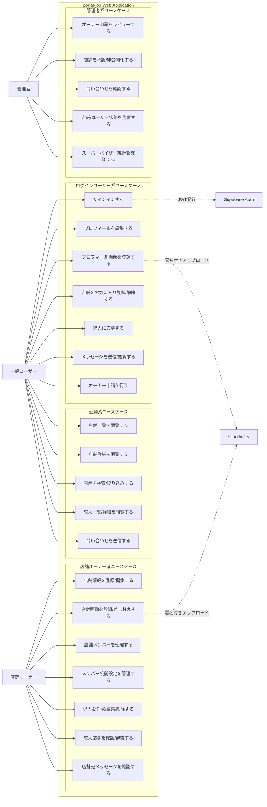
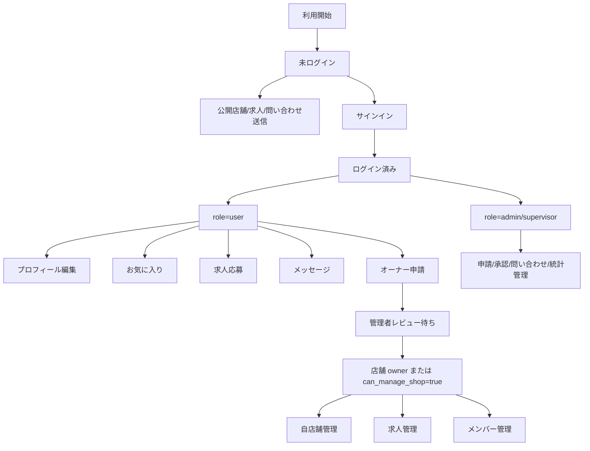

# portal-job ユースケース図

## 1. 目的

本書は、portal-job の主要利用者である一般ユーザー、店舗オーナー、管理者が、店舗検索・管理・求人・メッセージ・オーナー申請などの機能をどのように利用するかを定義する。

商用開発レベルのレビュー観点として、アクター、境界、認証要否、権限境界、外部サービス連携を明示する。

## 2. アクター定義

| アクター | 概要 | 主な権限 |
| --- | --- | --- |
| 一般ユーザー | 店舗/求人を閲覧し、ログイン後にお気に入り、求人応募、メッセージを利用するユーザー | 公開情報閲覧、本人情報更新、応募、メッセージ |
| 店舗オーナー | 自店舗の情報、求人、メンバー、公開設定を管理するユーザー | 自店舗管理、求人管理、応募確認、メンバー管理 |
| 管理者 | オーナー申請、店舗承認、問い合わせ、全体監督を行う運用者 | 申請レビュー、店舗承認、問い合わせ確認、管理画面利用 |
| 外部認証基盤 | Supabase Auth | 認証、JWT発行 |
| 画像配信基盤 | Cloudinary | 画像アップロード、画像配信 |

## 3. システム境界付きユースケース図

## 4. 認証・認可観点のユースケース関連

## 5. 主要ユースケース一覧

| ID | ユースケース | アクター | 事前条件 | 成功条件 |
| --- | --- | --- | --- | --- |
| UC-01 | 店舗一覧を閲覧する | 一般ユーザー | なし | 承認済み店舗が一覧表示される |
| UC-02 | 店舗詳細を閲覧する | 一般ユーザー | 対象店舗が存在する | 店舗画像、説明、タグ、SNSリンクが表示される |
| UC-03 | 店舗を検索/絞り込みする | 一般ユーザー | なし | カテゴリ/タグ/キーワード条件に一致する店舗が表示される |
| UC-04 | 求人に応募する | 一般ユーザー | ログイン済み、求人が open | 応募データが保存される |
| UC-05 | メッセージを送信する | 一般ユーザー/店舗オーナー | ログイン済み、送信先が存在する | メッセージが保存され会話に表示される |
| UC-06 | オーナー申請を行う | 一般ユーザー | ログイン済み | pending 申請が作成される |
| UC-07 | 店舗情報を編集する | 店舗オーナー | 店舗管理権限あり | 店舗情報が更新される |
| UC-08 | 店舗画像を登録する | 店舗オーナー | 店舗管理権限あり | Cloudinary へ画像が保存され、`media_assets` に active 画像が記録される |
| UC-09 | 求人を管理する | 店舗オーナー | 店舗管理権限あり | 求人の作成/更新/削除ができる |
| UC-10 | メンバー公開設定を変更する | 店舗オーナー | 店舗管理権限あり | 店舗ページで表示するプロフィール文/画像可否が更新される |
| UC-11 | オーナー申請をレビューする | 管理者 | admin/supervisor 権限あり | 申請が approved/rejected へ更新される |
| UC-12 | 店舗を承認する | 管理者 | admin/supervisor 権限あり | `shops.is_approved=true` になり公開一覧に表示される |
| UC-13 | 問い合わせを確認する | 管理者 | admin/supervisor 権限あり | 送信済み問い合わせを一覧確認できる |

## 6. 設計上の考慮事項（セキュリティやデータ整合性のリスク）

- 一般ユーザー、店舗オーナー、管理者は同じ `profiles` テーブルで管理されるため、`role` と店舗単位の `shop_members.can_manage_shop` の責務境界をテストで固定する必要がある。
- 店舗オーナー権限はグローバル role ではなく店舗単位の権限であるため、すべての店舗管理 API で `shop_id` に対する認可確認が必要である。
- オーナー申請承認後に `shops.owner_id`、`shop_members`、`owner_applications.status` の整合性が崩れると、UI上は承認済みでも管理できない状態が発生する。
- 求人応募とお気に入りは同時実行で重複しやすいため、アプリケーションロジックだけでなく DB 一意制約で守ることが望ましい。
- メッセージは本人/相手/店舗の組み合わせでアクセス制御を行う必要があり、URL の `userId` を差し替えた不正閲覧を防ぐ必要がある。
- Cloudinary 署名発行は認証必須とし、署名、secret、アップロード先 folder の悪用を防ぐためレート制限を検討する必要がある。
- 管理者機能は URL が推測可能なため、画面側の非表示だけではなく Go API 側で必ず認可を実施する必要がある。
