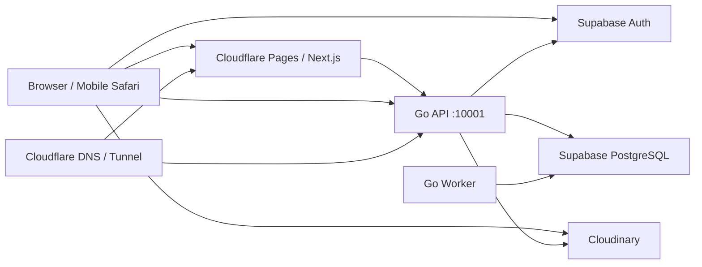
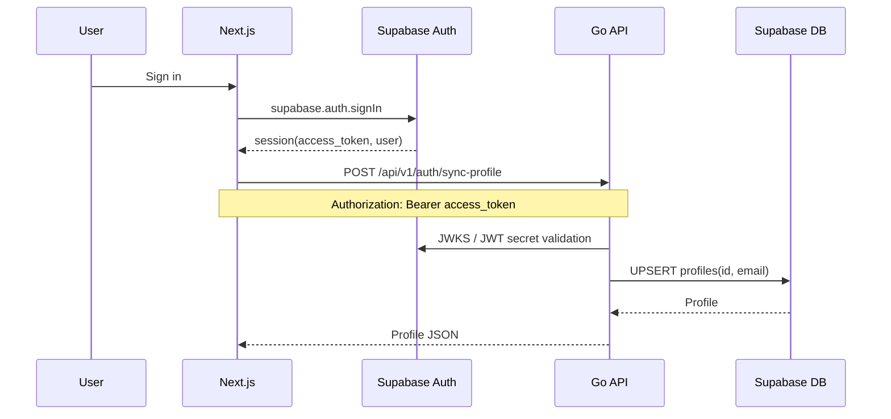
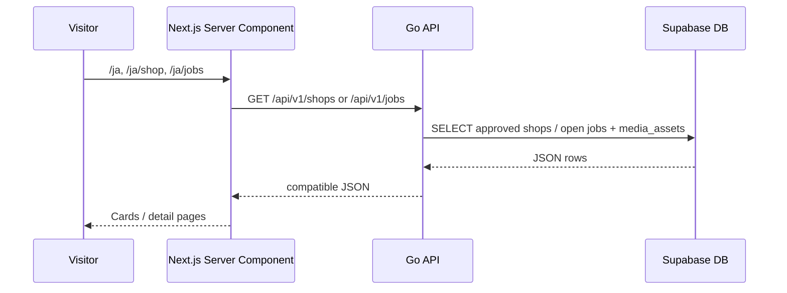
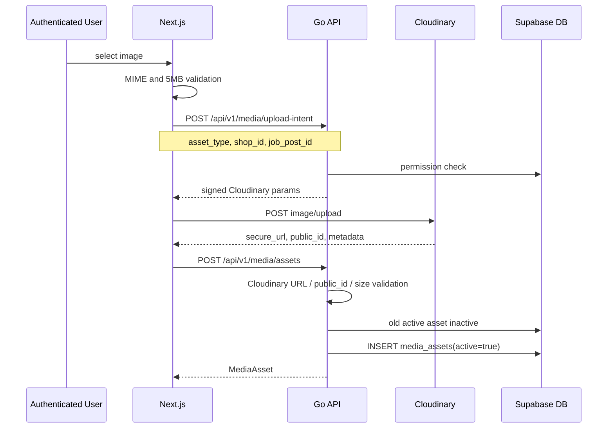
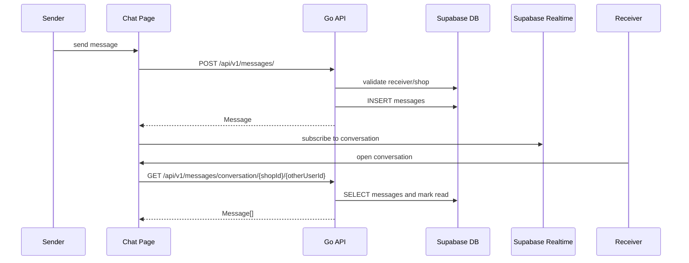
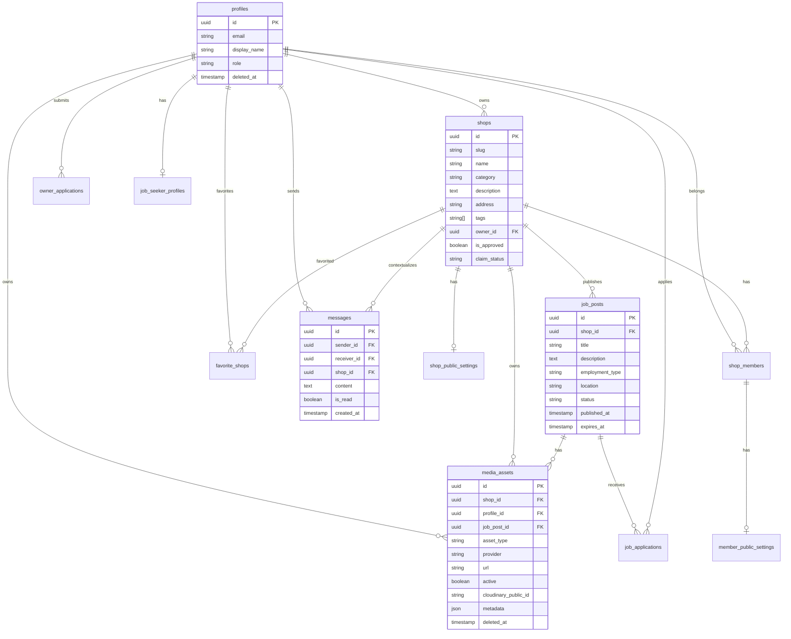

# portal-job システム詳細設計

最終更新: 2026-05-11

## 1. システム概要

portal-job は、Next.js App Router フロントエンド、Go API、Go worker、Supabase Auth/PostgreSQL、Cloudinary、Cloudflare DNS/Tunnel で構成する。

FastAPI (`backend/`) は Go 移行前の実装として残すが、リリース前の主実装・主検証対象は Go API (`go-api/`) である。



## 2. 実行環境

| 区分 | ローカル | コンテナ内部 | 本番想定 |
| --- | --- | --- | --- |
| Frontend | `http://localhost:3000` | `frontend:3000` | `https://portal-job.com` |
| Go API | `http://localhost:10002` | `http://go-api:10001` | `https://api.portal-job.com` |
| FastAPI | `http://localhost:10000` | `backend:10000` | 原則不使用 |
| PostgreSQL | `localhost:5434` | `db:5432` | Supabase PostgreSQL |

ローカルの推奨起動:

```bash
docker compose up -d --build
```

`docker-compose.yml` 内では旧バックエンドである `backend` (FastAPI) はコメントアウトされており、デフォルトで Go API が起動してフロントエンドの接続先となる。

## 3. API モジュール構成

| モジュール | 主な責務 |
| --- | --- |
| `go-api/cmd/api` | Go API 起動 |
| `go-api/internal/config` | env 読み込み |
| `go-api/internal/server/server.go` | router、CORS、internal token、request log |
| `go-api/internal/server/auth.go` | Supabase JWT 検証、current user 解決、role 認可 |
| `go-api/internal/server/auth_handlers.go` | profile sync、me、サポータープロフィール（API path は `job-seeker-profile`） |
| `go-api/internal/server/public_read.go` | 店舗/求人の公開読み取り route |
| `go-api/internal/server/shop_handlers.go` | 店舗更新、所属申請、メンバー関連 |
| `go-api/internal/server/write_handlers.go` | 求人 CRUD、お気に入り、応募 |
| `go-api/internal/server/messages.go` | メッセージ送信/会話取得 |
| `go-api/internal/server/misc_handlers.go` | media、push、inquiries、owner applications、supervisor |
| `go-worker/` | 求人/ブースト期限、Push 購読点検などの scheduled/internal job |

FastAPI の `backend/routers/*` は移行前の仕様参照・退避用であり、新規 API の追加先ではない。

## 4. 主要シーケンス

### 4.1 サインインとプロフィール同期



### 4.2 公開店舗/求人表示



### 4.3 画像アップロード



### 4.4 チャット



## 5. エンドポイント分類

詳細は `doc/api_definition.md` を正とする。

| 区分 | 主な API | 状態 |
| --- | --- | --- |
| Health/Internal | `/health`, `/internal/db/ping`, `/internal/version`, `/internal/jobs/expire-preview` | Go |
| Public Read | `/api/v1/shops`, `/api/v1/jobs` | Go |
| Auth/Profile | `/api/v1/auth/*` | Go |
| Shops/Favorites/Memberships | `/api/v1/shops/*`, `/api/v1/admin/shops/*` | Go |
| Jobs/Applications | `/api/v1/jobs/*`, `/api/v1/applications/*` | Go |
| Messages | `/api/v1/messages/*` | Go |
| Media | `/api/v1/media/*` | Go |
| Inquiries/Push/Settings | `/api/v1/inquiries/*`, `/api/v1/push/*`, `/api/v1/public/system-settings/*` | Go |
| Supervisor | `/api/v1/n2-supervisor-portal-xyz/*` | Go |

## 6. DB 論理モデル



## 7. 認証・認可設計

- フロントは Supabase SDK で session を取得する。
- `src/lib/api.ts` はクライアントでは Supabase session、Server Component では `sb-access-token` cookie から token を付与する。
- `sb-access-token` cookie は HTTPS では `Secure; SameSite=Lax` を付与する。
- Go API は `jwt.WithAudience("authenticated")` と有効期限必須で検証する。
- Go API は `profiles.deleted_at IS NULL` のユーザーのみ current user として扱う。

| 権限 | 判定条件 | 可能操作 |
| --- | --- | --- |
| user | `profiles.role='user'` | プロフィール、求人応募、お気に入り、メッセージ |
| admin | `profiles.role='admin'` | 店舗作成、申請レビュー、問い合わせ確認 |
| supervisor | `profiles.role='supervisor'` | 店舗承認、統計、問い合わせ、監督者向け店舗編集 |
| shop owner | `shops.owner_id=current_user.id` | 自店舗編集、メンバー/求人/画像管理 |
| shop manager | `shop_members.can_manage_shop=true` | 対象店舗の編集、メンバー/求人/画像管理 |

## 8. セキュリティ設計

- CORS は `localhost:3000`, `localhost:3001`, `portal-job.com`, `www.portal-job.com`, `staging.portal-job.com`, `*.portal-job.pages.dev` を許可する。リリース後は Pages preview の許可範囲を見直す。
- JSON-LD は `serializeJsonLd` で `<`, `>`, `&`, `U+2028`, `U+2029` をエスケープする。
- Cloudinary secret はフロントに出さず、Go API が短時間署名を発行する。
- 画像アップロードはクライアント・サーバー双方で MIME/サイズ/URL/public_id/権限を検証する。
- 内部 API は `X-Internal-API-Token` を必須にする。
- access token、Cloudinary secret、個人情報本文はログに出さない。

## 9. メディア設計

- 初期 provider は Cloudinary。
- `asset_type` は `shop_image`, `profile_image`, `job_image`。
- `job_image` は `media_assets.job_post_id` に紐づける。
- 同じ対象・同じ `asset_type` の active 画像は差し替え時に inactive にする。
- Cloudinary URL は表示時に `f_auto,q_auto,c_fill,...` の transformation を挿入する。
- 将来 GCS に移行する場合は `provider='gcs'`, `storage_bucket`, `storage_path` を利用する。

## 10. テスト・確認

主なコマンド:

```bash
npm run test:e2e
npm run test:e2e:go-public
npm run test:e2e:go-pages
npm run test:e2e:go-protected
E2E_AUTH_EMAIL=... E2E_AUTH_PASSWORD=... npm run test:e2e:go-auth
```

`go-public-read.spec.ts` は FastAPI 比較ではなく、Go API 単体の公開 API 契約テストである。

## 11. 運用上の注意

- 本番 VPS ではローカル開発用の環境設定やボリュームマウントを誤って使用しないよう注意する。
- `NEXT_PUBLIC_*` は Next.js build 時に焼き込まれるため、API URL 変更時は frontend rebuild が必要。
- `api.portal-job.com` は Cloudflare Tunnel / DNS の設定と Go API コンテナの死活が両方必要。
- FastAPI を完全削除する前に、1リリースサイクルは rollback 用コードとして残す。

## 12. 残課題

- チャット通知/画像アップロードのレートリミット。
- Cloudinary 旧ファイルの物理削除。
- 本番監視、ログ相関 ID、Cloudflare Tunnel の自動起動。
