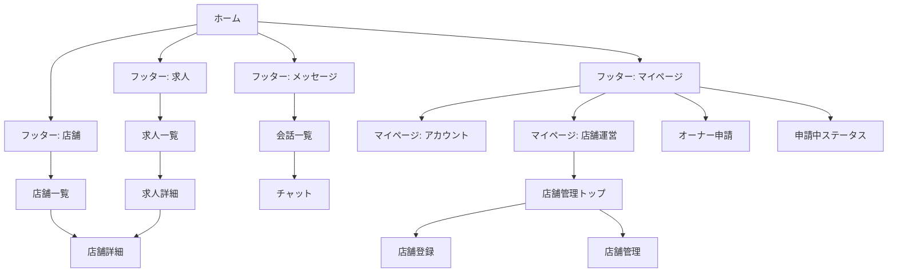

# portal-job スマホ向け画面遷移・マイページ設計資料

## 1. 目的

本資料は、スマホ利用時の主要導線を迷わず辿れるようにするため、フッターメニュー構成、マイページ内の情報設計、権限別表示ルール、画面遷移を定義する。

特に、現状で重複しやすい「店舗詳細」導線と「店舗管理」導線を整理し、実装時に判断がぶれない基準を示す。

## 2. 設計方針（結論）

- フッターメニューは 4 項目固定: `店舗` / `求人` / `メッセージ` / `マイページ`
- 「店舗詳細」は結果画面からのみ遷移する（入口を増やさない）
- マイページは「アカウント」と「店舗運営」を分離する
- ハンバーガーメニューは補助機能のみ（主要導線は入れない）

## 3. スマホ IA（情報設計）

### 3.1 フッター構成

| タブ | 役割 | 主要遷移 |
| --- | --- | --- |
| 店舗 | 店舗探索 | 店舗一覧 → 店舗詳細 |
| 求人 | 求人探索 | 求人一覧 → 求人詳細 → 店舗詳細 |
| メッセージ | 会話確認/送受信 | 会話一覧 → チャット |
| マイページ | 個人設定と運営操作 | アカウント系 / 店舗運営系 |

### 3.2 「店舗詳細」導線の統一

- `店舗` タブ経由: 店舗一覧から店舗詳細へ
- `求人` タブ経由: 求人詳細から店舗詳細へ
- 「すべてを見る」は一覧内部の表示操作として扱い、階層として独立させない

## 4. マイページ構成（タブ/ハンバーガー）

### 4.1 推奨 UI

- オーナー権限なし: タブなし 1 カラム
- オーナー権限あり: 2 タブ
  - `アカウント`
  - `店舗運営`

### 4.2 ハンバーガー利用ルール

- 配置してよい項目:
  - ヘルプ
  - 利用規約
  - プライバシーポリシー
  - ログアウト
- 配置しない項目:
  - オーナー申請
  - 店舗登録
  - 店舗管理

## 5. マイページ機能一覧（権限別）

### 5.1 共通（全ユーザー）

- プロフィール
- サポータープロフィール
- 設定

### 5.2 非オーナー

- オーナー申請（未申請時のみ）
- 申請状況表示（申請中のみ）

### 5.3 オーナー

- 店舗管理トップ
- 店舗登録
- 店舗管理（編集/公開設定/求人/応募確認）

## 6. 状態別表示仕様（未申請/申請中/承認済み）

| 状態 | マイページ表示 | 非表示項目 | 補足 |
| --- | --- | --- | --- |
| 未申請 | オーナー申請ボタン表示 | 店舗運営タブ | 申請導線を最上位に表示 |
| 申請中 | 申請ステータス表示（審査中） | オーナー申請ボタン、店舗運営タブ | 重複申請を防止 |
| 承認済み | 店舗運営タブ表示 | オーナー申請関連 UI | 承認後は運営導線を主導線化 |

## 7. 画面遷移図（スマホ）

## 8. 実装ガイド（画面要件）

- フッターは全主要画面で固定表示し、現在地を強調する
- マイページの先頭に権限状態を表示する（未申請/申請中/承認済み）
- 店舗運営系への入口は `店舗管理トップ` に集約し、同一階層で「店舗管理」を重複表示しない
- 主要導線（申請、登録、管理）は 2 タップ以内で到達可能にする

## 9. チェック項目

- ユーザーが 5 秒以内に「今どこにいるか」を理解できる
- 「店舗詳細」への入口が結果画面起点に統一されている
- 非オーナーに運営メニューが表示されない
- 承認済みユーザーにオーナー申請 UI が表示されない
- ハンバーガー内に主要業務導線が入っていない

