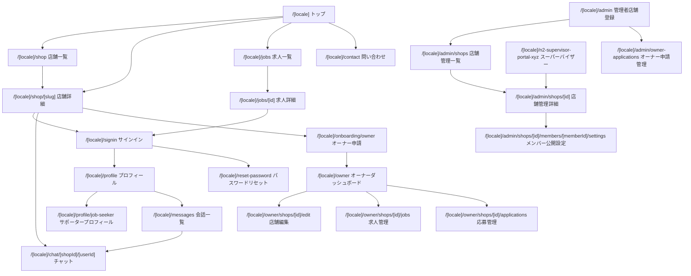

# portal-job 画面設計書

## 1. 画面遷移図

## 2. Next.js 画面ファイルと主要コンポーネント

| 画面 | ファイル | 主な利用者 | 主要コンポーネント/関連 API |
| --- | --- | --- | --- |
| トップ | `src/app/[locale]/page.tsx` | 閲覧ユーザー | `FavoriteButton`, `getShops`, `getMyFavorites`, `getPrimaryMediaAsset` |
| 店舗一覧 | `src/app/[locale]/shop/page.tsx` | 閲覧ユーザー | `callApi('/api/v1/shops')`, カテゴリ/タグ/検索 UI |
| 店舗詳細 | `src/app/[locale]/shop/[slug]/page.tsx` | 閲覧ユーザー | `ShopClaimButton`, `ShopMemberActionButtons`, `ShopSNSLinks`, `FavoriteButton` |
| 求人一覧 | `src/app/[locale]/jobs/page.tsx` | サポーター | `GET /api/v1/jobs` |
| 求人詳細 | `src/app/[locale]/jobs/[id]/page.tsx` | サポーター | 応募ボタン、`POST /api/v1/jobs/{id}/apply` |
| サインイン | `src/app/[locale]/signin/page.tsx` | 未ログインユーザー | Supabase Auth、`POST /api/v1/auth/sync-profile` |
| プロフィール | `src/app/[locale]/profile/page.tsx` | ログインユーザー | `getMe`, `updateMe`, `ImageUpload`, `getPrimaryMediaAsset` |
| サポータープロフィール | `src/app/[locale]/profile/job-seeker/page.tsx` | サポーター | `getJobSeekerProfile`, `updateJobSeekerProfile` |
| 会話一覧 | `src/app/[locale]/messages/page.tsx` | ログインユーザー | `GET /api/v1/messages/conversations` |
| チャット | `src/app/[locale]/chat/[shopId]/[userId]/page.tsx` | ログインユーザー | `GET /api/v1/messages/conversation/{shopId}/{userId}`, `POST /api/v1/messages/` |
| 問い合わせ | `src/app/[locale]/contact/page.tsx` | 全ユーザー | `POST /api/v1/inquiries` |
| オーナーダッシュボード | `src/app/[locale]/owner/page.tsx` | 店舗管理者 | 所属店舗、申請状態、管理導線 |
| 店舗編集 | `src/app/[locale]/owner/shops/[id]/edit/page.tsx` | 店舗管理者 | `PUT /api/v1/shops/{id}` |
| 求人管理 | `src/app/[locale]/owner/shops/[id]/jobs/page.tsx` | 店舗管理者 | `POST/PUT/DELETE /api/v1/jobs` |
| 応募管理 | `src/app/[locale]/owner/shops/[id]/applications/page.tsx` | 店舗管理者 | `GET /api/v1/jobs/{id}/applications`, `PATCH /api/v1/applications/{id}/status` |
| 管理者店舗登録 | `src/app/[locale]/admin/page.tsx` | 管理者 | `POST /api/v1/shops/admin`, `ImageUpload` |
| 管理者店舗一覧 | `src/app/[locale]/admin/shops/page.tsx` | 管理者/店舗管理者 | `GET /api/v1/shops/admin/all` |
| 管理者店舗詳細 | `src/app/[locale]/admin/shops/[id]/page.tsx` | 管理者/店舗管理者 | 店舗公開設定、メンバー管理、店舗画像 |
| メンバー公開設定 | `src/app/[locale]/admin/shops/[id]/members/[memberId]/settings/page.tsx` | 店舗管理者 | `GET/PUT /api/v1/admin/shops/{shopId}/members/{memberId}/public-settings` |
| オーナー申請管理 | `src/app/[locale]/admin/owner-applications/page.tsx` | 管理者 | `GET/PATCH /api/v1/admin/owner-applications` |
| スーパーバイザー | `src/app/[locale]/n2-supervisor-portal-xyz/page.tsx` | スーパーバイザー | `GET /api/v1/n2-supervisor-portal-xyz/stats`, `GET/PUT /shops`, `POST /approve`, `GET /inquiries` |

## 3. 共通 UI/レイアウト

| コンポーネント | 役割 |
| --- | --- |
| `src/components/Navbar.tsx` | PC向けヘッダーナビゲーション、ログイン状態、ロケール切替 |
| `src/components/BottomNav.tsx` | モバイル向け下部ナビゲーション |
| `src/components/ClientLayout.tsx` | 認証状態に応じたクライアントレイアウト制御 |
| `src/components/Footer.tsx` | フッター |
| `src/components/FavoriteButton.tsx` | 店舗お気に入り登録/解除 |
| `src/components/ImageUpload.tsx` | 画像アップロード UI。実処理は `src/lib/media-upload.ts` に委譲 |
| `src/components/ShopSNSLinks.tsx` | X/Instagram への外部リンク。PCは別タブ、スマホは同一タブ |
| `src/components/Notification.tsx` | 操作結果通知 |
| `src/components/ui/Modal.tsx` | 確認モーダル |
| `src/components/ui/Skeleton.tsx` | ローディング表現 |

## 4. 入力バリデーション・表示条件

| 画面/機能 | 入力項目 | バリデーション | 表示条件/制御 |
| --- | --- | --- | --- |
| サインイン | email, password | Supabase Auth の形式検証に従う | 成功時に profile sync を実行 |
| プロフィール | display_name | 空文字は避ける。最大長は今後明文化 | ログイン必須。プロフィール画像は `profile_image` の active 画像を表示 |
| サポータープロフィール | bio, desired_roles, availability_note, is_open_to_work | 文字数上限、タグ候補制約は今後明文化 | ログイン必須 |
| 店舗登録 | name, slug, category, address, description, tags, SNS ID | slug は一意。tags は定義済み候補から選択。description/custom_description は任意 | 管理者/店舗管理者のみ |
| 店舗編集 | 店舗登録と同等 | 既存店舗の管理権限を API 側で確認 | owner/admin/supervisor/can_manage_shop のみ |
| 画像アップロード | file | JPEG/PNG/WebP/HEIC、5MB以下。Go API側でもCloudinary URL/public_id/MIME/サイズを検証 | 1対象1 active 画像。差し替え時は旧画像 inactive |
| メンバー管理 | profile_id, role, display_name, status, employment_status, can_manage_shop | role/status は許可値のみ | 店舗管理権限必須 |
| メンバー公開設定 | is_visible_on_shop_page, show_profile_text, show_image, profile_text | profile_text は任意。画像はプロフィール画像を採用 | `show_image=true` でもプロフィール画像がない場合は画像非表示 |
| 求人作成 | title, description, status, application_deadline | title/description 必須。status は draft/open/closed/archived | 店舗管理権限必須 |
| 求人応募 | message | 任意。応募時に18歳以上確認チェックを行う | ログイン必須。確認済み状態は180日保持 |
| メッセージ | receiver_id, shop_id, content | content 必須。空白のみは不可にするべき | ログイン必須。送信者は current_user |
| 問い合わせ | inquiry_type, name, email, content | email は `EmailStr`。content 必須 | 未ログインでも送信可能 |
| オーナー申請 | reason, shop_id | reason 必須 | ログイン必須 |
| オーナー申請レビュー | status, review_comment | status は approved/rejected | admin/supervisor のみ |

## 5. 表示条件の詳細

### 5.1 店舗カード

- `is_approved=true` の店舗のみ公開一覧に表示する。
- 店舗画像は `getPrimaryMediaAsset(media_assets, 'shop_image')` の結果を使う。
- 店舗画像がない場合は店舗名またはプレースホルダーを表示する。
- お気に入りボタンはログイン済みの場合に登録状態を反映し、未ログイン時はサインイン導線を表示する。

### 5.2 店舗詳細

- SEO metadata、canonical、alternate URL、JSON-LD を設定する。
- X/Instagram ID がある場合のみ SNS リンクを表示する。
- 店舗への問い合わせ/メッセージ/オーナー申請導線はログイン状態と店舗状態に応じて表示する。

### 5.3 管理画面

- `role=admin/supervisor` は全店舗を管理できる。
- 一般ユーザーは owner または `can_manage_shop=true` の店舗のみ管理できる。
- 店舗公開前は一覧に表示されないが、管理画面では承認/編集対象として表示できる。

## 6. 現在の設計で想定される懸念点や考慮漏れ（エッジケース）

- UI のバリデーションが画面ごとに散っており、Zod などの共通 schema と Pydantic schema の対応表がない。
- 画像アップロードは `accept="image/*"` のみで、ファイルサイズ、拡張子、実 MIME、縦横サイズの制限 UI が未定義である。
- 管理画面とオーナー画面の責務が一部重なっており、将来の権限整理時に導線が重複する可能性がある。
- `show_image=true` だがプロフィール画像が未登録の場合の表示文言/代替 UI が明確でない。
- 店舗タグは選択式へ寄せているが、既存DBに定義外タグがある場合の表示/編集方針が必要である。
- メッセージ画面はリアルタイム更新ではなく手動取得/画面遷移前提のため、送信直後以外の同期遅延が起きる可能性がある。
- ロケール切替時にフォーム入力中の内容を保持するか破棄するかが未定義である。
