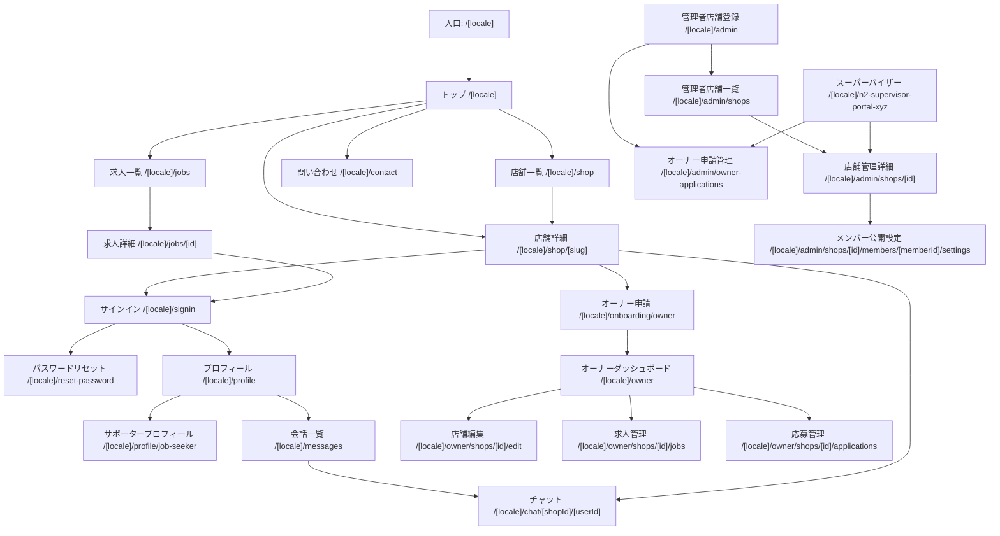
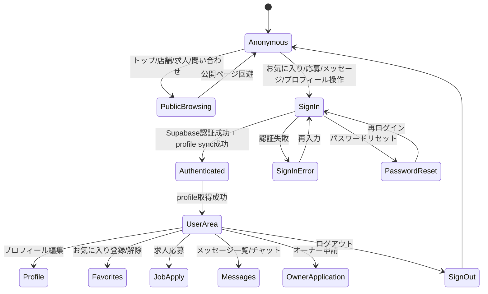
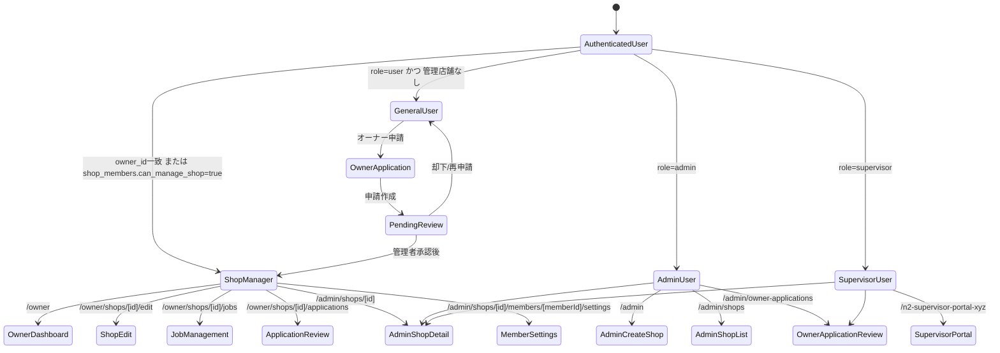
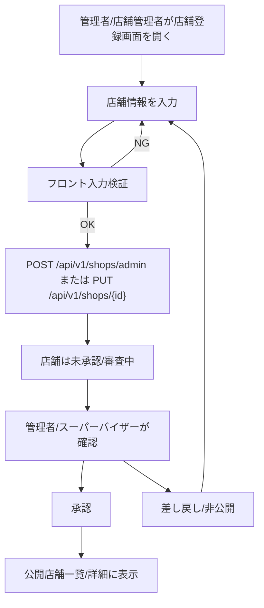
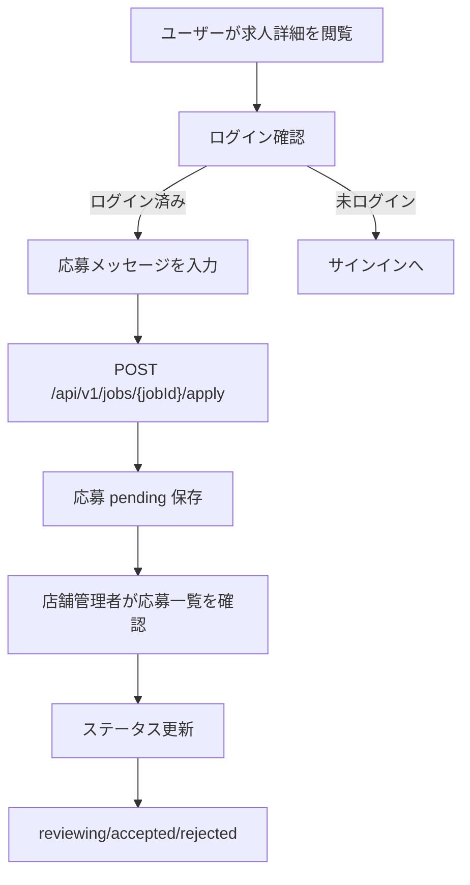

# portal-job 画面状態遷移図

## 1. 目的

本書は、Next.js App Router で実装される portal-job の画面遷移を、ログイン前後、ユーザー権限、店舗管理権限、管理者権限の観点から可視化する。

商用開発レベルのレビュー観点として、未ログイン時の遷移、認証後の遷移、権限不足時の戻り先、管理画面への到達条件を明確にする。

## 2. 全体画面遷移

## 3. ログイン状態による画面遷移

## 4. 権限別の管理画面遷移

## 5. 代表画面ごとの遷移条件

| 遷移元 | 遷移先 | 条件 | 権限不足/異常時 |
| --- | --- | --- | --- |
| 店舗詳細 | チャット | ログイン済み、送信先ユーザー/店舗が存在 | サインインへ誘導、またはエラー通知 |
| 店舗詳細 | オーナー申請 | ログイン済み | 未ログインならサインイン |
| 求人詳細 | 求人応募 | ログイン済み、求人 status=open | サインイン誘導、受付終了表示 |
| プロフィール | サポータープロフィール | ログイン済み | サインインへ誘導 |
| オーナーダッシュボード | 店舗編集 | 対象店舗の owner または can_manage_shop | 403 表示または一覧へ戻す |
| オーナーダッシュボード | 求人管理 | 対象店舗の管理権限あり | 403 表示または一覧へ戻す |
| 管理者店舗一覧 | 店舗管理詳細 | admin/supervisor または対象店舗管理者 | 403 表示 |
| 店舗管理詳細 | メンバー公開設定 | 対象店舗管理権限あり | 403 表示 |
| 管理者トップ | オーナー申請管理 | admin/supervisor | 403 表示 |
| スーパーバイザー | 店舗承認 | supervisor/admin | 403 表示 |

## 6. 主要業務フロー別の画面遷移

### 6.1 店舗登録から公開まで

### 6.2 求人応募から応募管理まで

## 7. 設計上の考慮事項（セキュリティやデータ整合性のリスク）

- 画面遷移上は管理画面リンクを非表示にできるが、API は直接呼び出される前提で必ずサーバー側認可を行う必要がある。
- ログイン直後に Supabase セッションはあるが `profiles` 同期に失敗した場合、画面はログイン済みでも API が 401/404 になるため、リトライまたは再同期導線が必要である。
- 権限不足時の UI は画面ごとにバラつくとユーザーが迷うため、403/404/未ログインの表示ポリシーを共通化する必要がある。
- 店舗登録/編集画面は管理者と店舗オーナーが共有するため、表示項目と送信可能項目を権限別に制限する必要がある。
- 求人応募、メッセージ、お気に入りはログイン状態の変化に影響されやすいため、送信直前にも session/token を再確認する必要がある。
- 多言語ルーティングでは locale 切替時に認証必須ページの戻り先が崩れないよう、redirect URL に locale を含める必要がある。
- Cloudflare Pages などフロント配信環境が変わる場合、API URL、CORS、Cookie、Supabase redirect URL の差分でログイン遷移が壊れる可能性がある。
